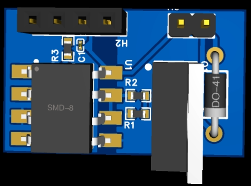

# Galvanic Gate Driver — Isolated MOSFET Driver

Optocoupled gate driver for a Formula SAE power-switching stage, built around a Toshiba TLP250 driving an Infineon IRF3205 MOSFET, with the control electronics kept galvanically isolated from the 12V power stage.



_Schematic and PCB layout exports are in `hardware/schematic/` and `hardware/pcb/`._

## Overview

| | |
|---|---|
| **Isolation** | TLP250 optocoupler (LED-side / output-side split) |
| **Switched device** | IRF3205 power MOSFET |
| **Control-side ground** | `GND` — MCU / PWM input reference |
| **Power-side ground** | `GNDP` — +12V gate drive, MOSFET source, flyback diode return |
| **Design tool** | EasyEDA |
| **Revisions** | 5 (2 schematic, 3 layout — see `docs/case-study.pdf`) |

## Why two separate ground pools?

`GND` (control) and `GNDP` (power) are never joined by copper anywhere on this board. The TLP250's optical link is the *only* path between the PWM input side and the 12V gate-drive side. This keeps switching noise, ground bounce, and any fault current on the power path from ever reaching the MCU's reference — the entire reason to use an optocoupled driver instead of driving the gate directly from the MCU.

## Design process

Five full revisions were needed before this board was accepted into the power-stage portfolio: two schematic-level issues (missing gate pull-down, missing flyback diode) and three PCB-level issues (a stray GND/GNDP bridge, insufficient creepage under the optocoupler, and an oversized gate-drive loop). Every fix traces back to a specific recommendation in the TLP250 or IRF3205 datasheet — no third-party reference design was used. Full writeup in [`docs/case-study.pdf`](docs/case-study.pdf).

## Repository structure

```
.
├── hardware/
│   ├── schematic/        # Schematic exports
│   ├── pcb/              # PCB layout exports
│   └── 3d-renders/       # 3D board renders
├── docs/
│   └── case-study.pdf    # Full design case study (context, decisions, revisions)
└── README.md
```

## Bill of materials (core)

| Ref | Part | Value / P/N |
|---|---|---|
| U1 | Optocoupler gate driver | TLP250(TP1,F) |
| Q1 | Power MOSFET | IRF3205 |
| D1 | Flyback diode | DO-41 |
| R1 | Gate pull-down (to GNDP) | 10 kΩ |
| R2 | Gate series resistor | 10 Ω |
| R3 | LED current limit (PWM in) | 330 Ω |
| C1 | +12V supply decoupling | 100 nF |
| H2 | +12V / GNDP connector | 2-pin |
| H3 | PWM input connector | 4-pin |

## Status

Revision 5 — validated in schematic/layout, part of the Formula SAE power-switching stack.

## License

MIT — see `LICENSE`.
